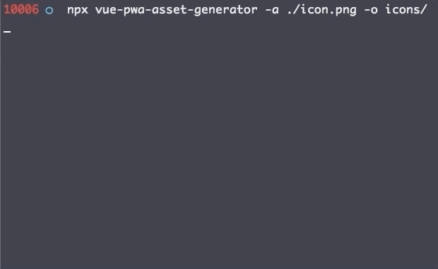

# Vue PWA asset generator


_TLDR_ :

```
npx vue-pwa-asset-generator -a {512x512_png_source | svg_source} [-o {output_folder}]
```

This package creates for you all the default assets used in a VueJS app with PWA plugin as well as a manifest JSON with the `icons` attribute set.



## Installation

You can use npx as shown above or you can install it globally:

```
npm install --global vue-pwa-asset-generator
```

or

```
yarn global add vue-pwa-asset-generator
```

## Usage

VueJS PWA asset generator has a `vue-asset-generate` command with two parameters :

- `-a`: input asset, it can be an SVG file or a PNG file (the largest image is a 512x512 png image).
- `-o` output folder (created if it does not exist). This parameter is optional, by default, `vue-pwa-asset-generator` will assume the command is run in a VueJS project. Therefor the `manifest.json` and `favicon.ico` are in `public` folder, the rest ies in `public/img/icons` folder.
- `--no-manifest`: option to not generate manifest.json file

## Examples

`vue-asset-generate -a logo.png -o img`

`vue-asset-generate -a logo.svg`

`vue-asset-generate -a logo.svg -o img`

## "Hey, I'm using the Vue plugin for pwa. Where do I put my manifest json?"

You can configure your PWA with the `vue.config.js` file.

Here an example of how you can merge the created `manifest.json` and your configuration file:

```js
module.exports = {
  // ... other configurations
  pwa: {
    themeColor: "#130f40",
    msTileColor: "#130f40",
    name: "My app",
    manifestOptions: {
      icons: [
        {
          src: "./img/icons/android-chrome-192x192.png",
          sizes: "192x192",
          type: "image/png",
        },
        {
          src: "./img/icons/android-chrome-512x512.png",
          sizes: "512x512",
          type: "image/png",
        },
        {
          src: "./img/icons/android-chrome-maskable-192x192.png",
          sizes: "192x192",
          type: "image/png",
          purpose: "maskable",
        },
        {
          src: "./img/icons/android-chrome-maskable-512x512.png",
          sizes: "512x512",
          type: "image/png",
          purpose: "maskable",
        },
        {
          src: "./img/icons/apple-touch-icon-60x60.png",
          sizes: "60x60",
          type: "image/png",
        },
        {
          src: "./img/icons/apple-touch-icon-76x76.png",
          sizes: "76x76",
          type: "image/png",
        },
        {
          src: "./img/icons/apple-touch-icon-120x120.png",
          sizes: "120x120",
          type: "image/png",
        },
        {
          src: "./img/icons/apple-touch-icon-152x152.png",
          sizes: "152x152",
          type: "image/png",
        },
        {
          src: "./img/icons/apple-touch-icon-180x180.png",
          sizes: "180x180",
          type: "image/png",
        },
        {
          src: "./img/icons/apple-touch-icon.png",
          sizes: "180x180",
          type: "image/png",
        },
        {
          src: "./img/icons/favicon-16x16.png",
          sizes: "16x16",
          type: "image/png",
        },
        {
          src: "./img/icons/favicon-32x32.png",
          sizes: "32x32",
          type: "image/png",
        },
        {
          src: "./img/icons/msapplication-icon-144x144.png",
          sizes: "144x144",
          type: "image/png",
        },
        {
          src: "./img/icons/mstile-150x150.png",
          sizes: "150x150",
          type: "image/png",
        },
      ],
    },
  },
};
```

## ⚠️

When generating assets from a png file, the generator creates a **black and white** svg for the `safari-pinned-tab.svg` icon, some manual modifications may be necessary.

I hope this will be useful as it is for me! ♥
